# Microsoft Intune Endpoint Management Lab

## Overview

This project demonstrates the deployment and management of a Windows 11 endpoint using Microsoft Intune and Microsoft Entra ID.

The lab simulates common System Administrator and Endpoint Administrator responsibilities, including user licensing, automatic MDM enrollment, Microsoft Entra ID device joining, security configuration, compliance enforcement, and application deployment.

A Windows 11 virtual machine was created in Hyper-V and used as the managed corporate endpoint throughout the project.

## Technologies Used

- Microsoft Intune
- Microsoft Entra ID
- Windows 11 Enterprise
- Microsoft Defender Antivirus
- Microsoft Company Portal
- Microsoft 365 Admin Center
- Hyper-V
- Windows PowerShell

## Lab Objectives

The objectives of this project were to:

- Configure a licensed Microsoft 365 test user
- Configure automatic Intune enrollment
- Create a Windows 11 virtual machine
- Join the Windows 11 device to Microsoft Entra ID
- Enroll and manage the device through Microsoft Intune
- Deploy Microsoft Defender security settings
- Create and enforce a Windows 11 compliance policy
- Verify device compliance from Intune
- Deploy an application through Intune
- Verify successful application installation on the managed endpoint

---

## 1. User Licensing

A test user was configured with the appropriate Microsoft licensing required for Intune device management.

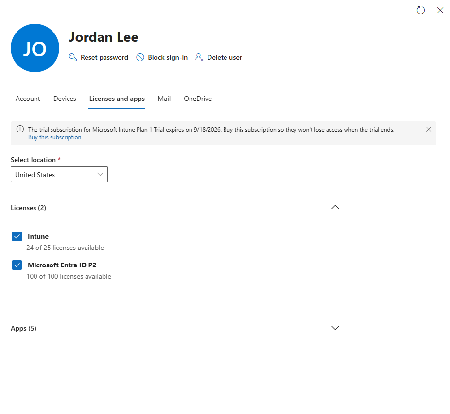

This ensures the user is licensed to enroll and manage devices through Microsoft Intune.

---

## 2. Automatic Intune Enrollment

Automatic MDM enrollment was configured so eligible Microsoft Entra ID users can automatically enroll their devices into Microsoft Intune.

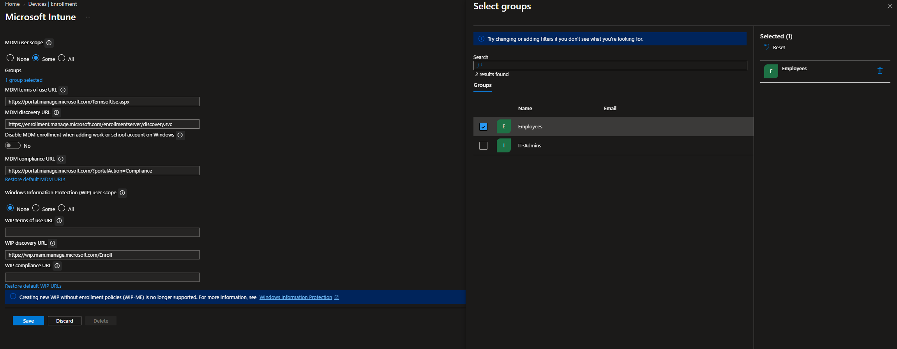

This allows devices joined to Microsoft Entra ID to become Intune-managed endpoints without requiring a separate manual enrollment process.

---

## 3. Windows 11 Hyper-V Virtual Machine

A Windows 11 virtual machine named `INTUNE-CLIENT01` was created using Hyper-V.

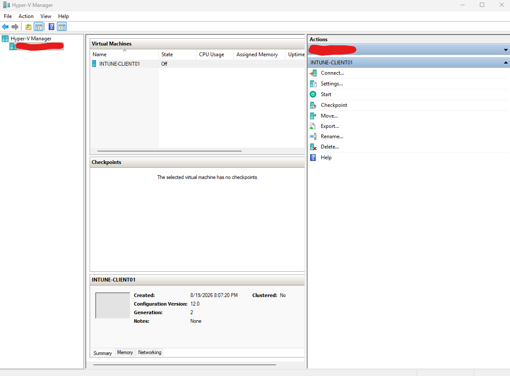

The virtual machine serves as the corporate Windows endpoint used to test Intune enrollment, security policies, compliance, and application deployment.

---

## 4. Microsoft Entra ID Join

The Windows 11 virtual machine was joined to the organization's Microsoft Entra ID tenant.

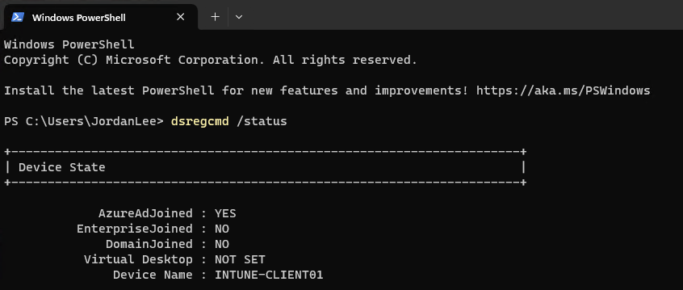

This establishes the device's organizational identity and allows it to participate in cloud-based identity and device management.

---

## 5. Intune Device Enrollment

After the Microsoft Entra ID join and automatic enrollment process, `INTUNE-CLIENT01` appeared as an Intune-managed corporate Windows device.

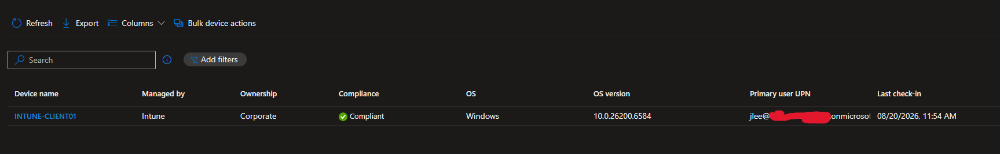

The device successfully enrolled into Microsoft Intune and reported its management and compliance information to the Intune admin center.

---

## 6. Microsoft Defender Configuration Profile

A Windows configuration profile was created in the Intune Settings Catalog to manage Microsoft Defender Antivirus security settings.

The policy was configured to enforce:

- Microsoft Defender real-time protection
- Behavior monitoring
- Scanning of downloaded files and attachments

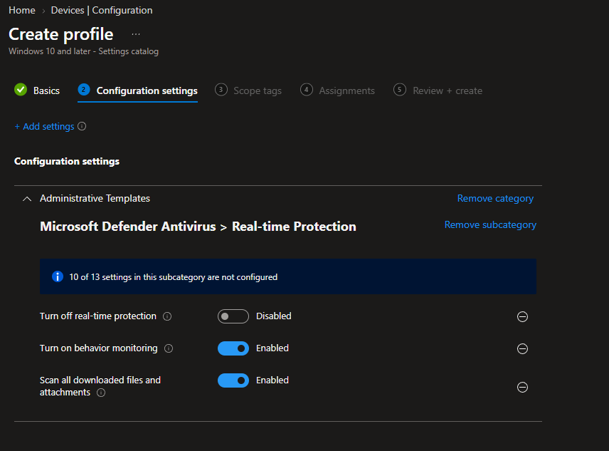

The configuration profile was assigned to the appropriate users/devices so the security settings could be centrally managed through Intune.

### Configuration Profile Deployment Verification

Intune reported that the security configuration profile was successfully applied.

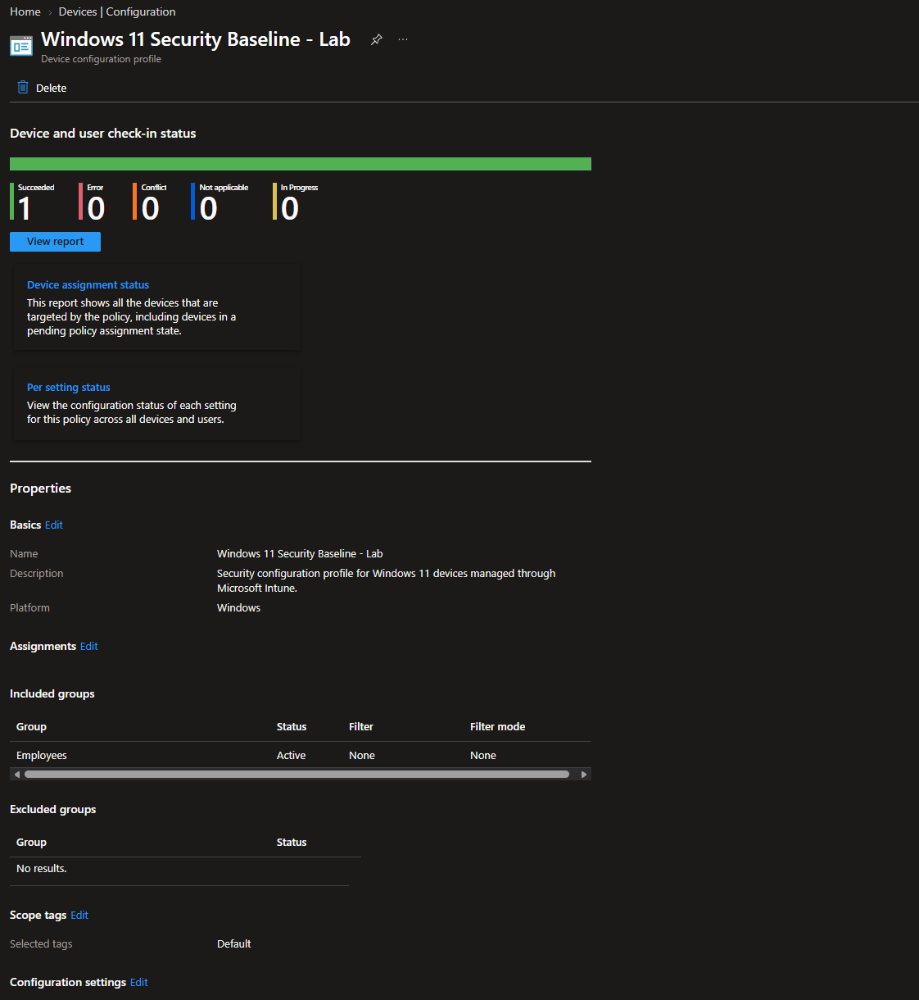

This verifies that the managed endpoint successfully received the security configuration from Intune.

---

## 7. Windows 11 Compliance Policy

A Windows compliance policy was created to define the organization's minimum security requirements for managed Windows endpoints.

The policy required security controls including:

- Secure Boot
- Code Integrity
- Windows Firewall
- Trusted Platform Module (TPM)
- Antivirus
- Antispyware
- Microsoft Defender Antimalware
- Microsoft Defender real-time protection

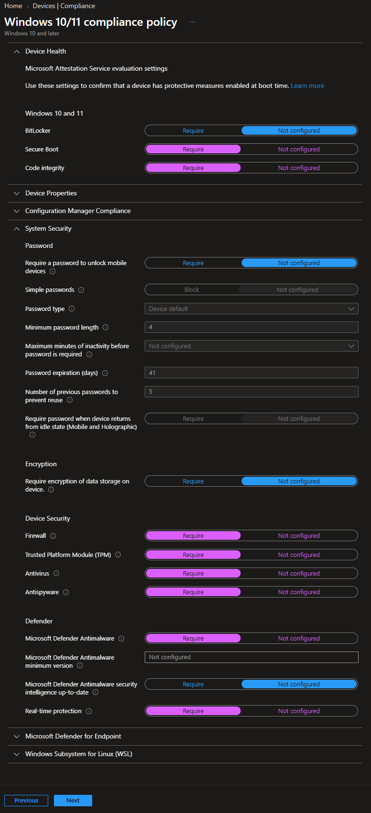

### Compliance Policy Configuration

The completed policy was assigned to the appropriate group, with noncompliant devices configured to be marked noncompliant immediately.

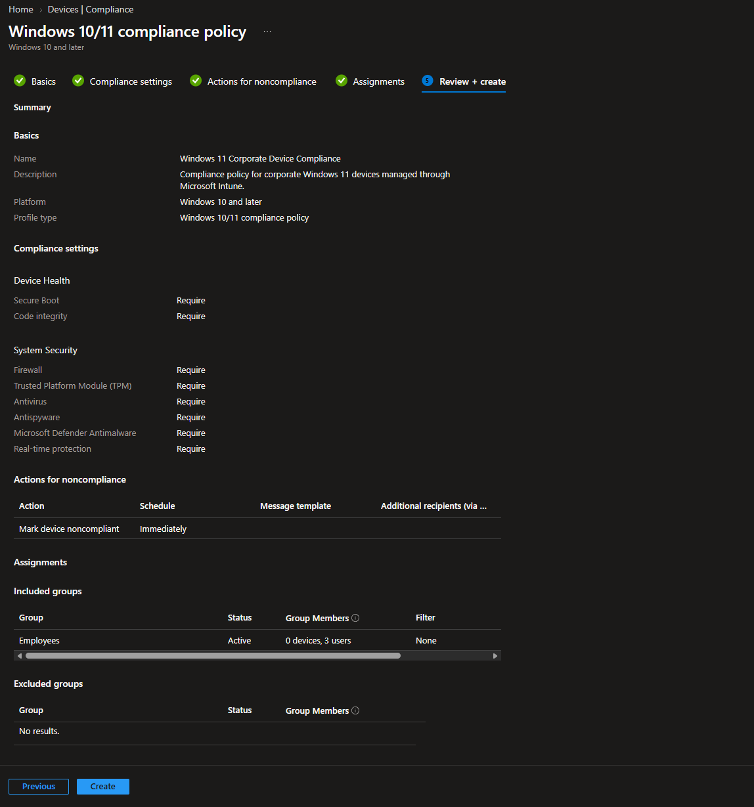

---

## 8. Compliance Verification

After the Windows 11 VM synchronized with Intune, the device successfully passed the compliance evaluation.

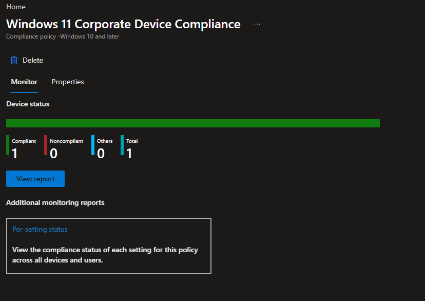

Intune reported:

- **Compliant devices:** 1
- **Noncompliant devices:** 0

### Per-Setting Verification

The per-setting compliance report was also reviewed to confirm that each configured security requirement passed successfully.

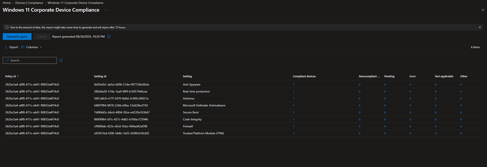

The report confirmed successful compliance for the configured security controls, including Secure Boot, Code Integrity, Firewall, TPM, Antivirus, Antispyware, Microsoft Defender Antimalware, and real-time protection.

---

## 9. Application Deployment with Intune

Microsoft Company Portal was added to Intune using the Microsoft Store app integration.

The application was configured as a **Required** deployment for the target group.

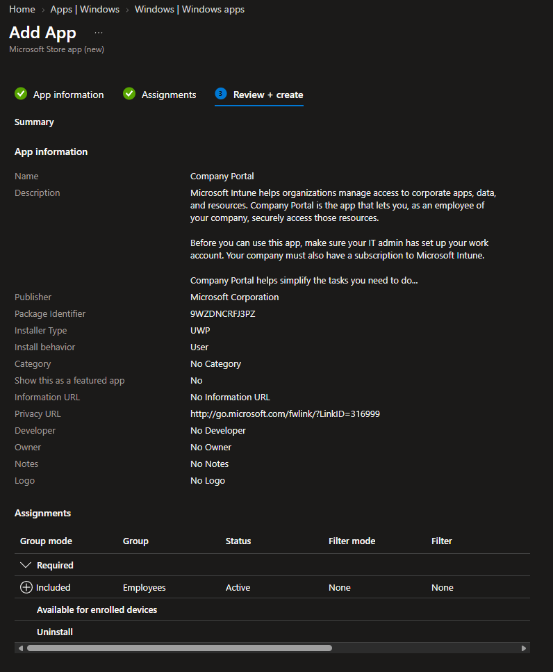

This configuration instructs Intune to automatically install Company Portal on devices associated with the assigned users.

### Installation Verification on Windows 11

After synchronizing the Windows 11 endpoint with Intune, Company Portal appeared in the VM's installed applications.

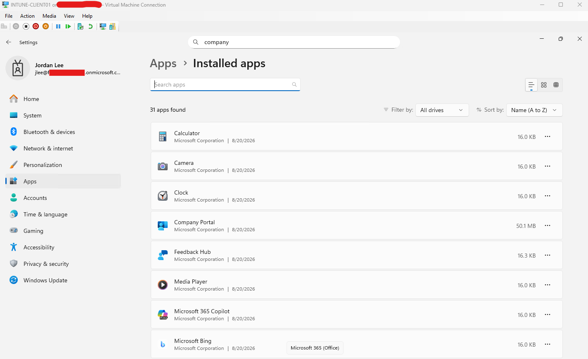

This confirms that the application reached the managed endpoint.

### Intune Deployment Verification

The Company Portal deployment was then verified from the Intune admin center.

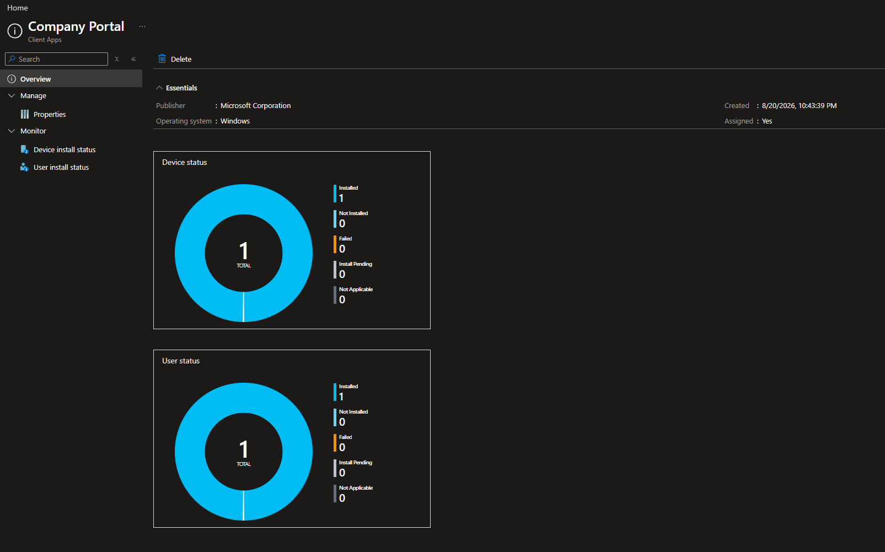

Intune reported:

- **Installed:** 1
- **Not installed:** 0
- **Failed:** 0
- **Install pending:** 0

This completes the full application deployment workflow:

**Intune assignment → Device synchronization → Application installation → Intune deployment verification**

---

## Project Outcome

This lab successfully demonstrated an end-to-end Microsoft Intune endpoint management workflow.

The final environment included:

- A licensed Microsoft 365 test user
- Automatic Intune MDM enrollment
- A Windows 11 Hyper-V virtual machine
- Microsoft Entra ID device join
- Successful Microsoft Intune enrollment
- Centrally managed Microsoft Defender security settings
- Windows 11 compliance requirements
- Successful device compliance evaluation
- Required Microsoft Store application deployment
- Successful Company Portal installation and deployment verification

The project demonstrates practical experience with technologies and tasks commonly used by System Administrators and Endpoint Administrators when managing corporate Windows devices through Microsoft cloud services.
